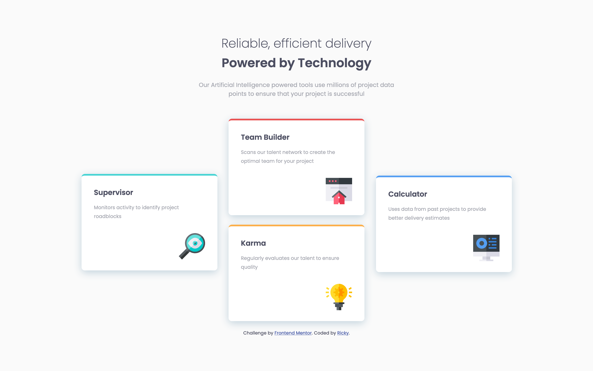

# Frontend Mentor - Four card feature section solution

This is a solution to the [Four card feature section challenge on Frontend Mentor](https://www.frontendmentor.io/challenges/four-card-feature-section-weK1eFYK). Frontend Mentor challenges help you improve your coding skills by building realistic projects. 

## Table of contents

- [Overview](#overview)
  - [The challenge](#the-challenge)
  - [Screenshot](#screenshot)
  - [Links](#links)
- [My process](#my-process)
  - [Built with](#built-with)
  - [What I learned](#what-i-learned)
  - [Useful resources](#useful-resources)

## Overview

### The challenge

Users should be able to:

- View the optimal layout for the site depending on their device's screen size

### Screenshot



### Links

- Solution URL: https://iamricky25.github.io/fourcardfeature/

## My process

### Built with

- Semantic HTML5 markup
- CSS custom properties

### What I learned

To arrange the cards, I first tried to center them using the margin property.  Failing that, I tried to use the float property.  None of those worked for me and I eventually discovered the positive: relative property.  That allowed me to move the cards anywhere I wanted; from there it was just trial and error to get them placed correctly. I also learned how to use the box-shadow property for adding shadows to elements.  

```css
.card {
  position: relative;
  left: 190px;
  bottom: 120px;
  box-shadow: 0px 5px 20px hsl(202, 28%, 81%);
}

### Useful resources

- The book called "HTML & CSS" by Jon Duckett; this is a great resource for starting to learn web development.